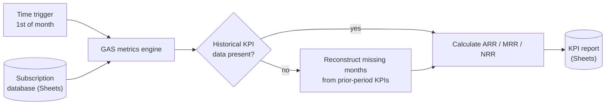

# Recurring Revenue Metrics Engine (ARR / MRR / NRR)

> **Context** Back-office services group · recurring service contracts
> **Stack** Google Apps Script · Google Sheets (contracts database)
> **Category** Finance automation & reporting

## The problem

Management needed monthly visibility on recurring-revenue health: ARR, MRR, New MRR, and NRR. The business sells recurring B2B services — a revenue model that behaves like SaaS financially, but was tracked in a plain Sheets database rather than billing software. Producing these numbers meant recurring manual exports and spreadsheet arithmetic each month across the active contract base. Worse, historical contract data was fragmented — some months simply had no recorded snapshot — so growth metrics like NRR could not be calculated reliably. Reports were late, error-prone, and management was always looking at stale numbers.

## Architecture

A scheduled Apps Script runs on the 1st of every month, reads the active subscription database, and computes the full KPI set. When a historical reporting period was missing, the engine rebuilt prior-period snapshots from the available contract records rather than relying on manual estimates. The reconstruction logic reused the same calculation path as the scheduled report and filtered records according to their effective start period. This made the historical series more consistent, while still depending on the quality and completeness of the underlying source data.

## Key decisions & trade-offs

- **Applying SaaS-style metrics to a services business.** ARR/MRR/NRR are standard SaaS metrics, but the underlying contracts here are recurring service agreements — not software subscriptions. The same financial logic applies (predictable recurring revenue, churn, expansion), and using these metrics gave management a framework they recognized from modern business reporting, applied to a traditionally low-visibility operational business.
- **Scheduled snapshot vs. on-demand calculation.** Metrics are computed and *stored* on the 1st of each month rather than recalculated live. Recurring-revenue metrics are point-in-time by definition — storing the snapshot made historical reporting easier to compare and review, even if source records were later edited.
- **GAS + Sheets vs. a BI tool.** The subscription data already lived in the Google Workspace ecosystem and the team works in Sheets daily. A BI tool would have added licensing cost and a maintenance dependency for what is ultimately a deterministic monthly calculation.
- **Reconstruct missing history instead of failing.** The alternative — refusing to compute metrics when a baseline month is missing — would have produced report gaps forever (the past can't be re-measured). Re-running the actual calculation against real subscription start dates was chosen over estimation because the data was always there; it just had never been snapshotted.
- **NRR is month-over-month, not the traditional 12-month cohort metric.** The formula is `(current MRR − new MRR) / prior month MRR`. This sidesteps the 12-month historical lookback dependency entirely and was appropriate for the reporting cadence needed — simpler, and robust against the patchy historical data the system was designed to handle.

## The hardest part

The hardest part was defining a useful recurring-revenue health metric despite incomplete historical snapshots. A traditional cohort-based retention metric would have required a reliable historical baseline that did not always exist. The implemented approach therefore focused on producing a consistent month-over-month reporting series from the available data, while making the historical reconstruction limitations explicit.

## Results

- Manual monthly reporting effort was significantly reduced through scheduled report generation.
- Calculation errors from manual spreadsheet work were reduced; metrics are derived directly from the subscription database by one calculation path.
- Gaps in historical KPI data are detected and can be rebuilt from the available source records.
- Management has a consistent, month-over-month comparable KPI series for the first time.

## Limitations & what I'd do differently

- Reconstructed historical rows are visually identical to live-run rows — there is no flag marking them as backfilled. Fine for internal use where the context is known, but an audit column indicating "reconstructed on [date]" would make the history more transparent and trustworthy to a new reader.
- The engine trusts the subscription database as its single source of truth; a data-entry error there flows straight into the KPIs. Input validation on the subscription sheet would be the next hardening step.
- Today I would persist KPI snapshots to a proper datastore (e.g. BigQuery) rather than Sheets, to get typed columns and a queryable history.
