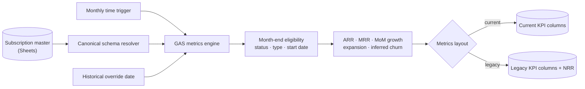

# Recurring Revenue Metrics Engine (ARR / MRR / Growth)

> **Context** Back-office services group · recurring service contracts
> **Stack** Google Apps Script · Google Sheets (contracts database)
> **Category** Finance automation & reporting

## The problem

Management needed monthly visibility into recurring-revenue health from a contract database that lived in Sheets rather than dedicated billing or BI software. Manual exports and spreadsheet arithmetic made reports slow and inconsistent. Historical reporting also evolved over time: the original layout used ARR, MRR, month-over-month growth, new MRR and a legacy NRR calculation, while the migrated layout separates expansion and inferred churn into annual and monthly values.

The engine needed to keep existing reports usable during the migration, produce repeatable month-end snapshots and avoid creating duplicate rows when a month was recalculated.

## Architecture

A scheduled Apps Script resolves the subscription and metrics schemas, selects selling-side contract records using their current lifecycle state and a target-month start-date cutoff, and aggregates annual contract value into ARR. MRR is derived from ARR; contracts starting in the target month contribute to expansion ARR and MRR. In the current layout, aggregate churn is inferred from prior ARR, expansion and current ARR. In the legacy layout, the original month-over-month NRR formula is retained for compatibility.

The target month is upserted by its month key, so rerunning a month updates the existing snapshot instead of appending a duplicate. The same calculation accepts an override date for controlled historical backfills.

## Key decisions & trade-offs

- **Support both metric schemas during migration.** The engine detects whether the workbook uses the current expansion/churn columns or the legacy NRR column and writes only fields that exist. This keeps historical reporting operational while allowing a clearer forward-looking model.
- **Store monthly snapshots instead of recalculating the whole history live.** Recurring-revenue metrics are point-in-time measures. Persisted rows are easier to compare and review, but later source corrections do not silently rewrite every historical month.
- **Upsert by month key.** A scheduled rerun or manual backfill updates one deterministic row. This removes duplicate-month cleanup at the cost of treating the month key as an application-enforced unique identifier.
- **Apply a month-end start-date cutoff.** Only eligible selling-side records whose start date is on or before the target month end contribute to the snapshot. This keeps backfills from counting future contracts, but current lifecycle state is not a complete historical-state model.
- **Infer churn at aggregate level.** The current model uses `prior ARR + expansion ARR - current ARR`, bounded at zero. It provides a useful operating signal from the available data, but it is not a customer-cohort churn model.
- **Retain legacy NRR semantics without relabelling them.** The old layout calculates `(current MRR - expansion MRR) / prior MRR`. The compatibility path preserves existing reports, while the current layout avoids presenting that value as traditional cohort-based NRR.
- **Use Sheets rather than introduce a BI platform.** The source data and users already live in Google Workspace. This keeps the workflow maintainable for the current scale, though typed storage and richer analysis remain future improvements.

## The hardest part

The hardest part was changing the metric model without corrupting the historical series. A direct schema replacement would either break the old report or silently reinterpret existing columns. Layout detection, canonical headers and month upserts allow the old and current definitions to coexist while making their different semantics explicit.

## Results

- Monthly ARR, MRR and growth snapshots are generated from one repeatable calculation path.
- Recalculated months update their existing row rather than producing duplicate periods.
- Historical months can be backfilled with the same logic used by the scheduled run.
- Both legacy and migrated metric layouts remain usable during the transition.
- Expansion and inferred churn are reported separately in the current layout.

## Limitations & what I'd do differently

- Expansion is identified from contract start dates, and churn is inferred from aggregate movement. Neither replaces contract-level movement events or a true customer-cohort retention model.
- Historical backfills reuse each record's current lifecycle status. A contract that has since ended may therefore be absent from a month in which it was active; reliable backdating would require status-effective dates or an event ledger.
- Backfilled rows are not marked with their calculation timestamp or source revision. An audit column would make reconstructed history easier to distinguish from live snapshots.
- The month key is unique only because the script enforces it; the spreadsheet itself provides no database constraint.
- Upstream preflight checks reduce invalid input, but the metrics engine still depends on the contract master as its source of truth. A typed datastore and event-level revenue ledger would support more rigorous retention analysis.
