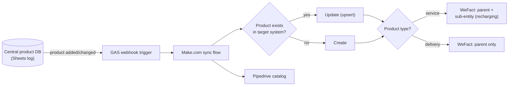

# Product Master Data Sync (Pipedrive & WeFact)

> **Context** B2B services group, multiple legal entities · products = services and physical deliveries
> **Stack** Google Apps Script (webhook trigger) · Make.com · Pipedrive · WeFact
> **Category** Master data management & API integration

## The problem

Every new or changed product had to be entered manually in three places: the central product database, the CRM (Pipedrive), and the invoicing system (WeFact). With no single source of truth, sales quoted from outdated catalogs and invoices went out with wrong names or prices. Product changes accured by default twice a year or when price changes where communicated by suppliers. The entity structure added real complexity: *service* products needed to exist in both the parent entity and the executing sub-entity (for internal recharging), while *delivery* products belonged to the parent entity only. Keeping that straight by hand was unrealistic.

## Architecture

A change in the central product database fires a GAS webhook into Make.com. The flow upserts the product into Pipedrive and WeFact, with conditional routing deciding *which* WeFact administrations get the product based on its type.

## Key decisions & trade-offs

- **One designated master.** The product database is the only place where products are created or edited; CRM and invoicing are read-only consumers. This deliberately sacrifices flexibility (sales can't add ad-hoc products in Pipedrive) to guarantee consistency — the precise failure mode we were eliminating.
- **Upsert instead of create-only.** Idempotent sync: replaying an event or re-syncing a product can never produce duplicates. This made the flow safe to re-run after partial failures.
- **Webhook from the database vs. Make polling the sheet.** Push keeps latency near-zero and avoids burning Make operations on empty polls; the GAS side already had an edit-log to hook into.
- **Routing logic in the flow, not in the data.** Product type (service vs. delivery) drives entity routing centrally in Make. The alternative — flagging target entities per product in the database — was rejected as one more manual field to get wrong.

## The hardest part

The internal-recharging routing. A service sold to a client by the parent entity is *executed* by a sub-entity, which must invoice the parent internally — so the same product needs to exist, with consistent identifiers, in two WeFact administrations at once. Getting the create/update logic idempotent across *both* administrations (where one might already have the product and the other not) required checking and branching per administration rather than treating "WeFact" as a single target.

## Results

- Invoicing errors from stale product names, prices, or wrong entities eliminated — invoices always reference the synced catalog.
- Triple data entry across three systems removed entirely.
- New products are available to sales and administration immediately after a single entry.
- The internal-recharging structure (parent ↔ sub-entity) is created correctly every time, without anyone having to remember the routing rules.

## Evolution: product group data moved out of Make (cost & maintainability)

The original sync resolved each product's group via a **per-record lookup against a Make.com data store** — costing Make operations on every record, and meaning product groups could only be maintained inside the Make platform.

The reference data was relocated into the product database. Product groups now live in a dedicated sheet keyed by a **category code** — the same code carried on the product records and written to the logbook sheet. During the run, the Apps Script matches on the category code across these sheets, resolves the correct product group ID, and includes it directly in the payload sent to the Make webhook. Make no longer performs any data store lookup.

**Result:**
- The per-record data store lookup is eliminated, lowering recurring Make operations cost.
- A new product group is added by editing a sheet instead of the Make data store — accessible to non-technical staff, and consistent with the config-driven approach used across the rest of the system.

**What I'd add:** validation on the category code (check against an allowed list) so a typo in the sheet can't pass an invalid group through the sync.

## Limitations & what I'd do differently

- The sync is one-directional. If someone edits a product directly in Pipedrive or WeFact, the change silently diverges until the next sync overwrites it there's no conflict detection. Locking down edit rights in the consumer systems was the pragmatic mitigation.
- Deletions or setting products to inactive was currently out of scope.
- Today I would add a periodic reconciliation run (compare master against consumers, report drift) as a safety net under the event-driven sync.
