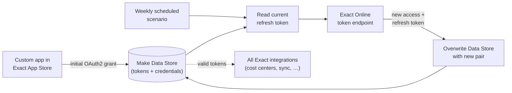

# OAuth2 Token Lifecycle Management (Exact Online)

> **Context** Internal IT infrastructure — every Exact Online integration depends on this
> **Stack** Make.com (scenario + Data Store) · Exact Online App Store app · OAuth2
> **Category** Security & API architecture

## The problem

All financial integrations with Exact Online authenticate via OAuth2, and Exact's implementation is strict: access tokens are short-lived and refresh tokens are **single-use** — each refresh invalidates the previous token, and the newly issued refresh token must be captured and stored within minutes or the chain is broken. Without automated management, every token expiry meant a developer manually re-authenticating, and until that happened, every downstream webhook and sync against the financial administration silently failed.

## Architecture

A custom app registered in the finance platform provides the OAuth2 client. After a one-time manual authorization, a scheduled workflow owns the token lifecycle: read the stored refresh token, exchange it for a fresh pair before expiry, and overwrite the credential store so consumer workflows can keep using valid credentials.

## Key decisions & trade-offs

- **One owner for the token chain.** Because Exact refresh tokens are single-use, two scenarios refreshing independently would race and break the chain (the loser holds a dead token). Centralizing rotation in one scheduled scenario, with consumers only ever *reading* the store, eliminates that class of failure by design.
**Scheduled rotation vs. refresh-on-demand.** Refreshing inside each consumer scenario would mean implementing the race-safe logic everywhere. A single weekly rotation — well within Exact's 30-day refresh token validity window — keeps the chain alive with one moving part. Running weekly rather than every 29 days is a deliberate safety margin: it means a single failed run can be missed and automatically retried the next week without the chain dying.
- **Make Data Store vs. external secret manager.** The Data Store keeps the whole solution inside the platform the team already operates, with access restricted to the Make organization. A dedicated secret manager would be more rigorous but adds infrastructure the organization had no other use for — see limitations.

## The hardest part

The initial token capture. The first refresh token issued during app authorization was valid for only ~3 minutes — the entire bootstrap (authorize, receive token, exchange it, persist the result to the Data Store) had to complete inside that window, after which the scenario takes over the chain. Designing the bootstrap so a human only has to do one simple authorization step, with the automation catching the baton immediately, took several iterations.

## Results

- Exact Online integrations run uninterrupted no broken connections from expired tokens since deployment.
- No hardcoded tokens anywhere; credentials live in one access-restricted store.
- Manual re-authentication effort was reduced; token management requires less recurring attention.

## Limitations & what I'd do differently

- The Data Store is not a true secret manager: values are visible to anyone with sufficient Make organization access, and there's no rotation audit log. For a larger team I'd move secrets to a dedicated store and have Make fetch them at runtime.
- Single point of failure by design: if the rotation scenario itself errors (e.g. Exact maintenance during the scheduled run), the chain can still die. A retry-with-alerting wrapper is the natural next hardening step.
- The pattern is Exact-specific in its constants but generic in shape it's the basis for a planned open-source template.
