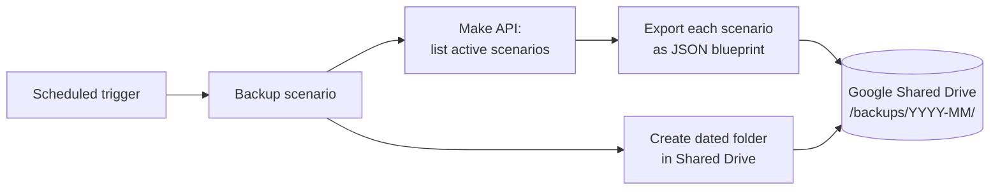

# Disaster Recovery: Automated Scenario Backups (Make → Drive)

> **Context** Internal IT infrastructure — automation logic lives in Make.com scenarios
> **Stack** Make.com API · Google Shared Drive
> **Category** DevOps, disaster recovery & business continuity

## The problem

A significant share of the company's operational logic — order-to-cash, lead routing, ERP sync — exists as Make.com scenarios. Make offers no built-in backup to external storage: if someone deletes, overwrites, or breaks a business-critical scenario, that logic is gone and must be rebuilt from memory. For an organization this dependent on its automation layer, that was an unacceptable business-continuity risk with no mitigation at all.

## Architecture

The automation platform backs *itself* up: a scheduled flow calls Make's own API, enumerates all active scenarios, exports each one's underlying definition as a raw JSON blueprint, and archives them into a freshly created, dated folder on a Google Shared Drive.

## Key decisions & trade-offs

- **JSON blueprints as the backup format.** Blueprints are Make's native import format — restore is "import file", taking seconds, which keeps the recovery time objective (RTO) minimal. It also means the automation logic now exists as portable plain-text artifacts, independent of the platform UI (a step toward infrastructure-as-code).
- **Monthly cadence vs. on-change backups.** Scenarios change occasionally, not daily; monthly full snapshots cover the realistic loss scenarios at near-zero operations cost. On-change backups would need change-detection polling against the Make API for marginal benefit. Cadence confirmed as monthly; no automated retention or cleanup policy exists — the archive grows indefinitely, which is fine at this volume and is an easy addition when it becomes relevant.
- **Shared Drive vs. git.** Git would give diffs and history semantics, but the people who need to restore a scenario in an emergency are admins, not developers. Dated folders on a Drive they already use beats a tool nobody else can operate. (Migrating these blueprints into git later remains easy — they're just JSON.)

## The hardest part

Honestly, the implementation was the easy part — Make's own API had a list-scenarios endpoint, and folder creation in Drive was a standard module. The harder problem was recognizing the gap in the first place: automation engineers rarely stop to back up the automation itself. The real work was defining what "restored" actually means — writing a restore runbook, documenting which connections must be re-linked manually (they're not in the blueprints), and making sure the right people knew where the backups lived and how to use them in an actual emergency. Technical simplicity can hide operational complexity.

## Results

- Every active scenario can be restored in seconds from its JSON blueprint — recovery went from "rebuild from memory, days of downtime" to "import file".
- The process runs fully autonomously; zero recurring effort or monitoring required.
- The organization's automation logic is now stored as portable plain-text artifacts outside the platform that runs it.

## Limitations & what I'd do differently

- **Connections and credentials are not in the blueprints.** A restored scenario must be re-linked to its app connections manually — the backup covers logic, not secrets. This is documented, but a restore-runbook with the connection mapping would shorten real recovery further.
- Monthly granularity means up to a month of scenario changes can be lost; acceptable here, but the cadence is a single constant to change.
- No automated restore test. A backup that's never been restored is a hope, not a guarantee — periodically importing a blueprint into a sandbox organization would close that gap.
- This is one of the most broadly reusable builds in the portfolio — a generic open-source version (`make-scenario-backup`) is planned.
