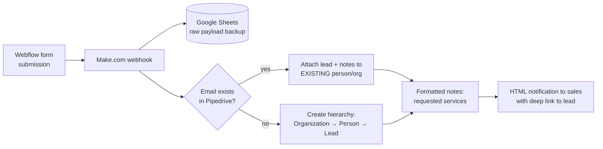

# Lead Routing & CRM Deduplication (Webflow → Pipedrive)

> **Context** B2B sales team · inbound leads via an extensive website quote form
> **Stack** Webflow · Make.com · Pipedrive · Google Sheets (failsafe store)
> **Category** CRM automation & sales operations

## The problem

Speed-to-lead decides deals, but website submissions (Webflow) were being retyped into the CRM (Pipedrive) by hand — at low inbound volume, each lead waiting hours to days for manual entry, occasionally missed entirely. The naive fix (a standard form→CRM integration) creates a worse problem: it pushes every submission blindly, so existing customers who fill in a new form become *duplicate* organizations and contacts. The CRM was already polluted with duplicates, and sales was losing sight of customer history.

## Architecture

Every submission is captured by a Make webhook, backed up raw, then routed through a search-first flow: match on email, attach to the existing profile if found, otherwise build the full Organization → Person → Lead hierarchy. Sales gets an HTML notification with a direct link within seconds.

## Key decisions & trade-offs

- **Search-first (dedupe at the gate) vs. periodic cleanup.** Deduplicating *before* records are created keeps the CRM clean by construction. Periodic merge-jobs were rejected: merging after the fact loses activity attribution and confuses sales in the meantime.
- **Email as the match key.** Simple, present on every submission, and right in the overwhelming majority of cases. Known trade-off: one person using two addresses creates a second profile — see limitations.
- **Raw payload backup to Sheets before any CRM logic.** If Pipedrive is down or the flow errors mid-way, the submission still exists somewhere recoverable. Leads are revenue; losing one to an API hiccup is not acceptable.
- **Notification with a deep link rather than a data dump.** The email tells sales *that* there's a lead and takes them to it in one click; the CRM stays the single place where lead data lives.

## The hardest part

Building the Pipedrive hierarchy correctly in the "new prospect" branch. Organization, person, and lead must be created in order, each linked to the previous one's returned ID, with the requested services (security, cleaning, hospitality) attached as formatted notes via additional API calls — and the whole chain has to behave sensibly if one step fails halfway. Two layers protected against this: the raw payload was already backed up to Sheets before any CRM logic ran, so the lead was never truly lost; and if a note step errored (e.g. a prospect entered characters that broke the API call), the note was skipped but the full lead data was still written to Pipedrive as a JSON field — the core record always landed, degraded notes never blocked it.

## Results

- Duplicate contacts and organizations from form submissions eliminated — repeat submitters land on their existing profile with full history intact.
- Speed-to-lead reduced from hours-to-days to seconds, with sales notified immediately.
- Account managers open every lead with the requested services already attached as structured notes.
- Zero lead loss: every submission exists in at least two places (CRM + raw backup) from the moment it arrives.

## Limitations & what I'd do differently

- Email-only matching misses the same person on a different address, and can't catch the same *company* arriving via a different contact. Today I'd add a secondary fuzzy match on organization name/domain with a manual-review route for near-matches.
- The Sheets backup is append-only with no retention policy; fine at this volume, but it quietly accumulates personal data — a GDPR-driven cleanup rule would be the responsible addition.
- The flow trusts Webflow's field validation; server-side validation in the Make flow would harden it against form changes breaking the mapping silently.
