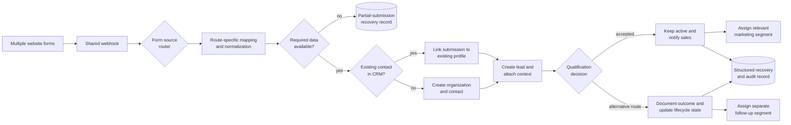

# Multi-Form Lead Routing, Qualification & CRM Deduplication

> **Context** B2B sales operation · multiple inbound website forms  
> **Stack** Website forms · Make.com · Pipedrive · email marketing platform · structured fallback storage  
> **Category** CRM automation & sales operations

## The problem

The original automation handled one inbound website form, but the lead-capture environment expanded to include additional forms with different field structures and follow-up requirements.

Creating a separate automation for every new form would duplicate the same CRM logic across multiple scenarios. That would make identity matching, record creation, notifications and future changes harder to maintain consistently.

A basic form-to-CRM integration also introduced another risk: blindly creating a new contact for every submission would fragment customer history and pollute the CRM with duplicate people and organizations.

Not every submission required the same operational response either. Some needed immediate sales follow-up, others required alternative lifecycle handling, and incomplete submissions needed a recoverable path.

The goal was to extend the existing search-first CRM architecture so multiple form types could be processed through one coordinated lead-intake workflow.

## Architecture

A shared webhook received submissions from multiple website forms and routed each event according to its source.

Each route translated its own incoming field structure into the normalized values required by the downstream CRM process. This allowed forms to evolve independently without duplicating the complete lead-processing workflow.

Complete submissions continued through a search-first identity-resolution step. Existing contacts were reused where possible, while new prospects received the required organization, contact and lead records.

A separate qualification layer then determined the appropriate lifecycle outcome. Accepted leads remained active, triggered sales notifications and were assigned to a relevant marketing segment. Submissions requiring a different follow-up route were documented and processed consistently instead of remaining unnoticed in the active pipeline.

Incomplete submissions and failed secondary actions had explicit recovery paths rather than disappearing silently.

## Key decisions & trade-offs

- **Route by form source before applying CRM logic.** Different website forms could use their own field mappings while continuing into one shared downstream process.

- **Normalize data before processing.** Incoming forms did not always use identical field names or structures. A mapping layer converted them into a consistent internal format before CRM actions were performed.

- **Search-first deduplication.** Contacts were searched by email before creating new records. Repeat submitters could therefore be connected to their existing CRM history.

- **Create related CRM records in a controlled sequence.** When no existing contact was found, organization, contact and lead records were created in dependency order so returned identifiers could be linked correctly.

- **Separate lead creation from qualification.** A valid submission was first represented consistently in the CRM. A dedicated decision layer then determined its operational lifecycle.

- **Segment only after the outcome was known.** Marketing-group assignment was based on the normalized lead category and qualification result rather than sending every submission into the same follow-up sequence.

- **Preserve the core CRM record when secondary actions fail.** Marketing updates and notifications were treated as secondary integrations. Their failure should not silently remove the underlying lead from the CRM process.

- **Use structured recovery records.** Incomplete submissions and workflow failures were recorded so they could be investigated or processed later.

## The hardest part

The hardest part was evolving a working single-form integration into a multi-form orchestration workflow without copying the complete CRM process for every new form.

Each source could provide different field names, optional values and follow-up requirements, but every complete submission still needed to resolve into the same CRM relationship:

1. identify or create the organization;
2. identify or create the contact;
3. create the lead;
4. preserve the submitted context;
5. determine the qualification outcome;
6. trigger the appropriate sales and marketing follow-up.

The solution was to keep route-specific differences near the intake layer and preserve a shared downstream architecture for identity matching, CRM creation, qualification and recovery.

This reduced duplicated logic while allowing new forms and follow-up requirements to be added without rebuilding the complete integration.

## Results

- Multiple inbound form types were handled through one coordinated lead-intake architecture.
- Repeat submitters were matched against existing CRM contacts before new records were created.
- New prospects received consistently linked organization, contact and lead records.
- Accepted leads received structured sales follow-up and category-based marketing segmentation.
- Submissions requiring an alternative lifecycle followed a documented route rather than remaining in the active sales pipeline.
- Partial submissions and failed secondary integrations had explicit recovery paths.
- New form routes could be introduced without recreating the entire downstream CRM workflow.
- Deployment of form-specific changes became easier to maintain because shared CRM behaviour remained centralized.

## Limitations & what I'd do differently

- **Email remained the primary match key.** A stronger identity-resolution layer could also use normalized company domains and organization names, with manual review for uncertain matches.

- **Form mappings were route-specific.** A more mature version would introduce formal payload schemas and version validation so upstream form changes fail visibly instead of breaking mappings silently.

- **Qualification rules were embedded in workflow logic.** I would move them into a governed configuration layer and cover them with decision-table tests.

- **Cross-platform actions were not one atomic transaction.** A coded implementation could use persistent event storage, idempotency keys and replayable background jobs to improve recovery across CRM, notification and marketing systems.

- **Marketing segmentation requires explicit data-governance rules.** Consent status, retention periods and unsubscribe behaviour should be handled and documented consistently.
