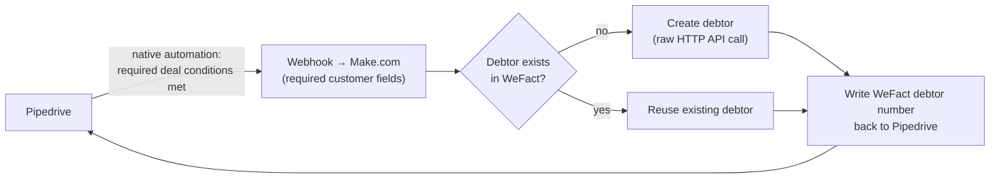

# Order-to-Cash: Automated Debtor Creation (Pipedrive → WeFact)

> **Context** B2B services group · every signed deal needs a debtor in the invoicing system before billing can start
> **Stack** Pipedrive (native automations) · Make.com · WeFact
> **Category** Order-to-cash & financial integration

## The problem

When a deal hit "Signed" in the CRM, someone had to retype the customer into the invoicing system (WeFact) as a debtor — company name, KvK number, billing address — before the first invoice could go out. At a low volume of high-value deals, each delay and each typo had direct revenue impact. Two technical constraints shaped the solution: polling the CRM for changes would burn API quota continuously for rare events, and existing customers signing a *new* deal must not become duplicate debtors.

## Architecture

Pipedrive's own automation engine fires a webhook only when the required deal conditions are met, pushing the validated customer payload to Make. The flow checks WeFact for an existing debtor, creates one only if needed, and writes the debtor number back to the CRM — closing the loop so both systems reference each other 1-to-1.

## Key decisions & trade-offs

- **Push (event-driven) vs. pull (polling).** Having the CRM fire webhooks on exact conditions means the integration consumes resources only when something actually happened. Polling would have meant continuous API traffic, platform load, and operations cost to detect a handful of events per week — and added latency on top.
- **Condition logic lives in Pipedrive, not Make.** Using Pipedrive's native automations as the trigger gate keeps "when does this fire" visible and editable where the sales-ops team already works, instead of buried in a Make filter.
- **Dedupe before create.** Same principle as the lead flow: an existing customer signing a new deal reuses their debtor record. The check costs one API call and prevents the financial administration from fragmenting across duplicates.
- **Write-back makes the link bidirectional.** Storing the WeFact debtor number on the Pipedrive deal/organization turns the CRM into a reliable index into the books — and it's exactly this field that later automations (cost-center creation, ETL to operations) key on. Each flow leaves behind the state the next one needs: a deliberate chain architecture.

## The hardest part

Field mapping at the boundary of two systems with different data models — making sure the KvK number, billing address, and contact details land in the right WeFact fields for every service type. Incomplete data never reached the integration: Pipedrive's stage gate configuration prevented deals from advancing to "Signed" without the required fields filled in, so validation happened in the CRM before the webhook ever fired.

## Results

- Lead time from signed deal to invoice-ready debtor reduced from manual delay to near-instant automation.
- Manual data entry and the associated typos in billing addresses and KvK numbers eliminated.
- Significant API and platform load avoided by the push architecture — no polling overhead at all.
- No duplicate debtors; CRM and bookkeeping stay linked 1-to-1 via the written-back debtor number.

## Limitations & what I'd do differently

- The dedupe check matches on KvK number first, falling back to company name if no KvK is present; a company that changed legal names or KvK numbers could slip through as a new debtor.
- Updates after creation are out of scope: if the address changes in the CRM later, the WeFact debtor isn't updated automatically — confirmed, address sync is handled separately — a candidate for the same upsert treatment as the product sync.
- Today I'd add an idempotency guard on the webhook itself (Pipedrive can re-fire on automation edits), though the exists-check already makes a duplicate create harmless.
