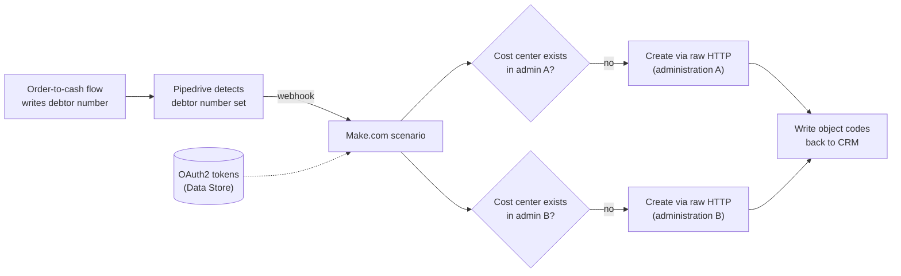

# Multi-Administration Cost Center Automation (Pipedrive → Exact Online)

> **Context** Connected finance setup · operational and financial records need consistent object-level tracking
> **Stack** Pipedrive · Make.com · Exact Online API (raw HTTP, OAuth2 from the [token management system](03-oauth2-token-management.md))
> **Category** Finance automation & ERP integration

## The problem

Reliable object-level reporting requires related operational and financial records to share the same cost center structure across connected finance administrations. Every new object meant finance manually creating matching records more than once, with names that had to stay consistent. Skipped or mistyped cost centers meant downstream reporting and allocation became unreliable.

## Architecture

A domino architecture: completion of the debtor-creation flow (which writes the WeFact debtor number to the CRM) is itself the trigger for this one. The scenario authenticates with stored OAuth2 tokens, checks *per administration* whether the cost center exists, creates whatever is missing in parallel, and reports the object codes back to the CRM.

## Key decisions & trade-offs

- **Chained processes ("domino") vs. one mega-flow.** Each step (deal → debtor → cost centers) is a separate scenario triggered by the previous one's written-back result. This keeps every flow small, independently testable, and re-runnable — at the cost of the chain's state living in CRM fields rather than a single orchestrator. For this team size, debuggability won.
- **CRM as the master for naming.** One object name entered in the CRM propagates to matching cost-center structures across the required finance administrations. The alternative, finance naming cost centers directly in the finance system, was the status quo that produced mismatches.
- **Check-then-create per administration.** Each administration is independent — one can already have the cost center while another does not. Treating "Exact" as one target would have made re-runs unsafe; per-administration idempotency makes the flow safe to fire twice.
- **Raw HTTP over connector modules.** The cost-center endpoints and administration switching needed more control than the standard connector exposed; raw requests with manually managed tokens were the reliable path.

## The hardest part

Administration-specific authentication and routing. Every API call must target the right finance administration with a valid token. Composing this from stored authentication data and configuration, with per-administration existence checks, is where most of the engineering time went.

## Results

- Reliable object-level reporting: related records land on the same cost center automatically, in each required administration.
- The full chain — new deal → debtor → cost centers — runs without any manual finance work.
- One name in the CRM produces a matching data structure across the required finance administrations.
- The correct object code is available in each required administration from day one, so downstream financial allocation works without manual correction.

## Limitations & what I'd do differently

- The domino chain's state lives in CRM fields, so a human clearing or editing those fields can re-trigger or break the chain — guard conditions mitigate but don't eliminate this. With more flows, I'd introduce an explicit orchestration/state layer.
- Renaming an object after creation doesn't propagate to Exact — confirmed create-once; the flow is chained off initial debtor creation and has no update trigger, so renames in the CRM don't reach Exact.
- Failure visibility relied on Make's error handling, which wrote a diagnostic note to the Pipedrive deal identifying exactly which step broke — making the failure visible in the CRM and the deal manually retryable. For a finance-critical chain I'd now add proactive alerting rather than waiting for someone to notice the note.
