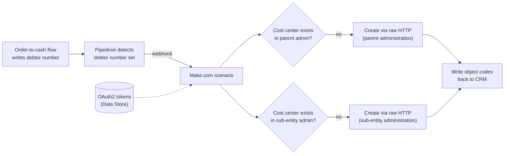

# Multi-Entity Cost Center Automation (Pipedrive → Exact Online)

> **Context** Facility/multi-services group · staff paid from sub-entities, client invoiced from the parent — profitability tracked per object via cost centers
> **Stack** Pipedrive · Make.com · Exact Online API (raw HTTP, OAuth2 from the [token management system](03-oauth2-token-management.md))
> **Category** Finance automation & ERP integration

## The problem

Knowing whether a project or object is profitable requires linking purchasing (hours, from the sub-entity's books) and sales (client invoices, from the parent's books) to the same cost center (object code) in Exact Online. Every new job meant finance manually creating that cost center **twice** — once in the parent administration, once in the executing sub-entity's administration — with names that had to match exactly. Skipped or mistyped cost centers meant hours couldn't be recharged correctly and management lost sight of per-object profitability.

## Architecture

A domino architecture: completion of the debtor-creation flow (which writes the WeFact debtor number to the CRM) is itself the trigger for this one. The scenario authenticates with stored OAuth2 tokens, checks *per administration* whether the cost center exists, creates whatever is missing in parallel, and reports the object codes back to the CRM.

## Key decisions & trade-offs

- **Chained processes ("domino") vs. one mega-flow.** Each step (deal → debtor → cost centers) is a separate scenario triggered by the previous one's written-back result. This keeps every flow small, independently testable, and re-runnable — at the cost of the chain's state living in CRM fields rather than a single orchestrator. For this team size, debuggability won.
- **CRM as the master for naming.** One object name entered in Pipedrive propagates to identical cost-center structures across multiple Exact administrations. The alternative (finance naming cost centers in Exact) was the status quo that produced mismatches.
- **Check-then-create per administration.** The parent and sub-entity administrations are independent — one can already have the cost center while the other doesn't. Treating "Exact" as one target would have made re-runs unsafe; per-administration idempotency makes the flow safe to fire twice.
- **Raw HTTP over connector modules.** Exact's cost-center endpoints and multi-administration switching needed more control than the standard connector exposed; raw requests with manually managed tokens were the reliable path.

## The hardest part

Multi-administration authentication and routing. Every API call must target the right Exact *division* (administration) with a valid token — against tokens that rotate weekly via a separate system, and divisions that differ per sub-entity. Composing this from stored tokens + division IDs from configuration, inside Make's HTTP modules, with per-administration existence checks, is where most of the engineering time went.

## Results

- Real-time per-object profitability: purchasing and sales land on the same cost center automatically, in both administrations.
- The full chain — new deal → debtor → cost centers — runs without any manual finance work.
- One name in the CRM produces an identical, correct data structure across multiple Exact Online administrations, every time.
- Sub-entities have the right object code available for time registration from day one, so internal recharging flows cleanly.

## Limitations & what I'd do differently

- The domino chain's state lives in CRM fields, so a human clearing or editing those fields can re-trigger or break the chain — guard conditions mitigate but don't eliminate this. With more flows, I'd introduce an explicit orchestration/state layer.
- Renaming an object after creation doesn't propagate to Exact — confirmed create-once; the flow is chained off initial debtor creation and has no update trigger, so renames in the CRM don't reach Exact.
- Failure visibility relied on Make's error handling, which wrote a diagnostic note to the Pipedrive deal identifying exactly which step broke — making the failure visible in the CRM and the deal manually retryable. For a finance-critical chain I'd now add proactive alerting rather than waiting for someone to notice the note.
