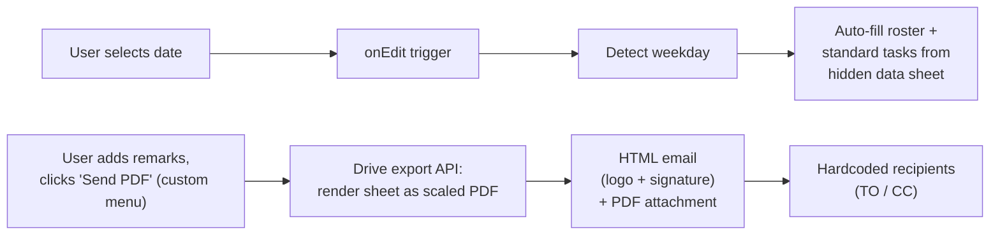

# Field Service Reporting Tool (One-Click Daily PDF Reports)

> **Context** Field staff at an operational site · daily reports to external stakeholders
> **Stack** Google Apps Script · Google Sheets (UI) · Drive export API · Gmail (HTML mail)
> **Category** Custom internal tools

## The problem

Field staff ended every shift with the same administrative ritual: type out routine tasks by hand, wrestle a spreadsheet into a presentable PDF, and email it to the right stakeholders. Reports were inconsistent (forgotten tasks, typos), formatting broke regularly, and mails occasionally went to the wrong addresses. External stakeholders judged the service through an artifact that was too easy to make inconsistent. The goal: a one-click experience for users with limited IT affinity.

## Architecture

A Google Sheet doubles as the application UI. Selecting the date fires an `onEdit` trigger that recognizes the weekday and pre-loads that day's roster and standard tasks from a hidden data sheet. A custom menu button renders the sheet as a properly scaled PDF via the Drive export API and sends it inside a branded HTML email to preset stakeholders.

## Key decisions & trade-offs

- **A spreadsheet as the app.** Field staff already knew Sheets; a web app or mobile app would have meant training, login management, and development time for what is fundamentally a daily form. The trade-off — Sheets' limited UI control — was acceptable for a single-screen workflow.
- **Day-specific auto-fill from a hidden data sheet.** Routine tasks differ per weekday; encoding them as data (not code) means a supervisor can adjust the standard task list without touching the script.
- **Protected recipients, deliberately.** The one place where flexibility was *removed*: field users cannot change who receives the report. Misdirected reports were a real incident class; removing that input reduces the incident risk.
- **Drive export API over a Docs/PDF library.** Exporting the sheet itself (with tuned scaling parameters) keeps the report layout maintainable in the sheet, visible to the people who use it — no separate template to keep in sync.

## The hardest part

Getting the PDF rendering production-quality. The Drive export endpoint takes a set of poorly documented URL parameters (size, scale, gridlines, print area), and the defaults produce exactly the broken layouts the team suffered from manually. Finding the parameter combination that rendered the report correctly regardless of how much text a user entered took sustained trial and error.

## Results

- The entire end-of-shift process is one date selection plus one button click; no IT knowledge, downloads, or manual formatting involved.
- Writing out routine tasks is reduced through day-specific auto-fill, lowering the chance of forgotten standard tasks.
- External stakeholders receive a consistently formatted PDF in a professional HTML email every day — feedback confirmed they were happy to receive a clear, consistent report rather than the irregular output they'd seen before.
- Misdirected-report risk is reduced by construction.

## Limitations & what I'd do differently

- Recipients being hardcoded means a stakeholder change requires a script edit — the right fix is a protected config range (the pattern used in the [document management app](11-document-management-app.md)), keeping the no-field-user-access property while making changes self-service for supervisors.
- One sheet serves one site; only one location was in production, though the architecture (data sheet + script) is designed to replicate easily to additional sites by copying the template.
- No offline path: a field user without connectivity at shift end can't file the report from the field.
