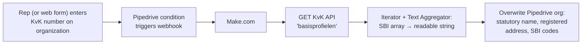

# CRM Enrichment: Chamber of Commerce (KvK) API

> **Context** B2B sales · accurate legal entity data needed for invoicing, risk profiles, and service agreements
> **Stack** Pipedrive · Make.com · KvK API (basisprofielen endpoint)
> **Category** Data enrichment & API integration

## The problem

Sales reps entered companies into the CRM by their trade name and moved on — official statutory names, registered addresses, and SBI industry codes were missing or wrong. Finance then hit the wall downstream: invoices need the legal entity name and registered address, and incomplete records stalled the order-to-cash process. Manually copying data from the KvK website is exactly the kind of repetitive, error-prone work that shouldn't exist.

## Architecture

Entering or changing a KvK number on an organization fires a webhook. Make queries the official KvK basisprofiel, flattens the multi-activity SBI array into a readable string, and overwrites the CRM record with government-verified data.

## Key decisions & trade-offs

- **The KvK number as the only required input.** One field that reps can realistically be held to, from which everything else derives. Asking sales for complete data entry had failed; asking for one number works.
- **Overwrite, don't merge.** Registry data wins over whatever was typed in the CRM — that's the point of the integration. The trade-off is that any legitimate manual correction gets overwritten on the next trigger; accepted, because the registry is authoritative for exactly these fields (statutory name, registered address).
- **Push-based, like every CRM flow in this portfolio.** The KvK API and Make are only hit when a number is actually added or changed — relevant here because the KvK API is metered, and the push-only trigger keeps usage strictly proportional to actual data changes.
- **Aggregate SBI codes to a human-readable field.** Companies often have multiple registered activities. Rather than storing the first or dumping raw JSON, an Iterator + Text Aggregator step produces one readable string — imperfect relationally, but immediately usable for segmentation by the people reading the CRM.

## The hardest part

The SBI data shape. The basisprofiel returns activities as a nested array of varying length, and Make's mapping model doesn't handle "unknown-length array → one text field" natively — it takes an explicit iterate-then-aggregate construction with separator and ordering handled manually. Small in lines of work, but the difference between an integration that handles real registry data and one that only works for single-activity companies.

## Results

- Data entry for organizations reduced to one field: the KvK number. The system fills in the rest.
- Invoice-blocking data issues (wrong legal names, missing registered addresses) eliminated at the source — records are government-verified before the deal ever closes.
- Multi-activity companies get complete, readable industry profiles in the CRM, improving segmentation.
- API usage is strictly proportional to actual data changes.

## Limitations & what I'd do differently

- Enrichment is one-shot: a company that relocates or renames after enrichment keeps stale data until someone re-touches the KvK field. A periodic re-validation sweep over active customers would close this.
- No handling for KvK numbers that return no result (typo'd or deregistered) beyond a silent skip — the CRM fields simply aren't updated. A visible "enrichment failed" flag on the org would make failures actionable by sales.
- Overwrite semantics are right for registry fields but the field list needs discipline — adding a non-registry field to the mapping later would silently destroy manual data.
