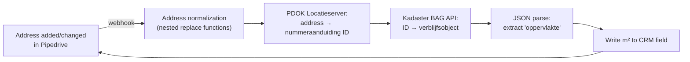

# Real Estate Enrichment: Address → m² (Kadaster BAG API)

> **Context** B2B services · floor area (m²) is a standard input in operational estimation
> **Stack** Pipedrive · Make.com · PDOK Locatieserver · Kadaster BAG API
> **Category** Data enrichment & geo-API integration

## The problem

Operational estimates commonly depend on a building's floor area. Account managers looked m² up manually in public registers for every request — slow, and dangerously imprecise: an overestimated area makes the proposal less competitive, an underestimated one creates delivery risk. Compounding it, addresses in the CRM were free-text and messy (country suffixes, commas, typos), so even careful lookups started from bad input. The fix had to be autonomous and anchored to an official source.

## Architecture

A three-stage government-API chain: normalize the raw CRM address string, resolve it to the official address identifier (nummeraanduiding) via PDOK's geocoder, then fetch the registered residence object (verblijfsobject) from the BAG and extract its usable floor area — written straight back to the deal's m² field.

## Key decisions & trade-offs

- **Two-step resolution (PDOK → BAG) instead of address-matching against BAG directly.** PDOK's Locatieserver is built for fuzzy, real-world address input and returns the exact official identifier; the BAG API then needs no guessing at all. Each API does what it's best at.
- **Normalize input rather than demand clean input.** Sales will never enter addresses consistently — that's a fact, not a training problem. Text cleanup (stacked replace operations stripping country names, punctuation, double spaces) meets the data where it is.
- **Registered area as the source of truth, knowing its limits.** BAG `oppervlakte` is the legally registered usable area — authoritative and consistent, but not always identical to the operationally relevant area (see limitations). Consistency across all estimates was worth more than per-building precision arguments.
- **Write-back to a dedicated CRM field.** The m² lands where the operational calculation already reads, so users can continue the workflow seconds after entering an address without leaving the CRM.

## The hardest part

Address string sanitization. The pipeline is only as good as its match rate, and the raw failure cases were all input formatting: inconsistent casing, postal-code fragments, country suffixes, punctuation, and address parts that look numeric but are not. Building the nested replace/normalization logic that pushed messy real-world strings to a reliable PDOK match — without mangling legitimate address components — was iterative, driven by actual failed lookups. In practice, every address attempted resolved successfully once the normalization was in place.

## Results

- Users get a standardized area value immediately after entering an address — no register lookups, no leaving the CRM.
- m² figures come from the official Kadaster/BAG registration, eliminating guesswork-driven margin loss on operational delivery.
- Messy address input self-corrects: the normalization layer makes the lookup robust against the inconsistencies that previously broke manual searches.

## Limitations & what I'd do differently

- **Registered ≠ serviceable area.** BAG area covers the verblijfsobject's usable floor space; multi-tenant buildings, partial rentals, or outdoor areas need human judgment. The automation sets the default; calculators can override by typing an m² value directly into the field — the enriched value is not locked.
- Addresses resolving to multiple verblijfsobjecten (business parks, large complexes) result in no data being written — the m² field is left empty rather than silently setting a potentially wrong value. A review flag for multi-match cases would be the right next step.
- No re-check on renovations/changes in the registry; like the KvK flow, enrichment is event-driven and one-shot.
- Generic version of this chain (address → BAG data) is on the open-source list — it's useful to any Dutch company that works with building-level operational data.
