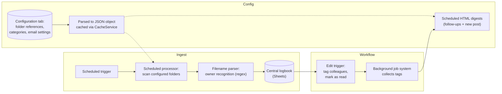

# Enterprise Document Management App (Config-Driven GAS)

> **Context** Umbrella organization with changing structures · daily inflow of critical mail and tax authority correspondence via Drive
> **Stack** Google Apps Script · Google Sheets (logbook + config) · Drive · Gmail (HTML digests)
> **Category** Internal application development

## The problem

Critical post for several organizational areas landed across many Drive folders with no central overview: who needs to read which letter, what follow-up actions exist, and were they done? Beyond the workflow problem sat an architectural one: organizational names and folder structures change. If all of that is hardcoded, every organizational change needs a developer — making the system itself the bottleneck it was meant to remove.

## Architecture

A file processor regularly sweeps configured intake folders, recognizes the owning category from filename conventions, and writes each document into a central logbook. Staff work *in* the logbook — tagging colleagues, marking items read — and a job system batches those events into scheduled, personalized HTML digests. Operational settings live in a configuration tab the script parses and caches at runtime.

## Key decisions & trade-offs

- **Config-driven over hardcoded — the central decision.** Administration staff add a category or change a digest time by editing a spreadsheet row, never touching code. Cost: the script must validate its own config defensively because configuration mistakes are now runtime data, not compile-time errors. Worth it: the developer bottleneck is significantly reduced, with the config handling routine organizational changes.
- **Scheduled digests instead of instant notifications.** A mail per document would train everyone to ignore notifications within a week. Batched digests at deliberate moments respect attention as the scarce resource.
- **`CacheService` for the config.** The config parse is re-needed by every trigger run; caching the parsed JSON keeps the scheduled processor and the `onEdit` handlers fast instead of re-reading the sheet each invocation.
- **Native data validation tied to config.** Dropdowns in the logbook sync from the configuration, so invalid categories or statuses are harder to enter — pollution is prevented at the cell level rather than cleaned up afterwards.

## The hardest part

Designing the config schema so non-technical staff could *safely* hold the keys. The naive version — "put folder IDs in a sheet" — fails the first time someone pastes a URL instead of an ID or leaves a row half-filled. The robust version validates every row, fails loudly with a readable error pointing at the offending cell, and treats the cache correctly when config changes mid-day. Making a system *less* fragile while making it *more* editable by laypeople is the real trick.

## Results

- Incoming documents appear in the right logbook within a short interval, with correct file links and ownership attribution, reducing manual entry.
- Config changes such as folders, schedule times and recipients are made by administration staff in the config tab without routine developer involvement.
- Follow-up on critical government correspondence is structurally faster: tagged actions surface in the morning digest until handled.
- Invalid logbook entries are impossible by construction (config-synced validation).

## Limitations & what I'd do differently

- Owner recognition depends on filename conventions; misnamed files need manual correction in the logbook. An OCR/content-based classifier would remove the convention dependency — at significant complexity cost.
- The scheduled sweep is polling; fine at this volume, but Drive push notifications (via a small web app endpoint) would be the cleaner trigger at larger scale.
- GAS quotas (trigger runtime, email/day) bound the design; the architecture works *with* them, but a much larger organization would outgrow the platform.
