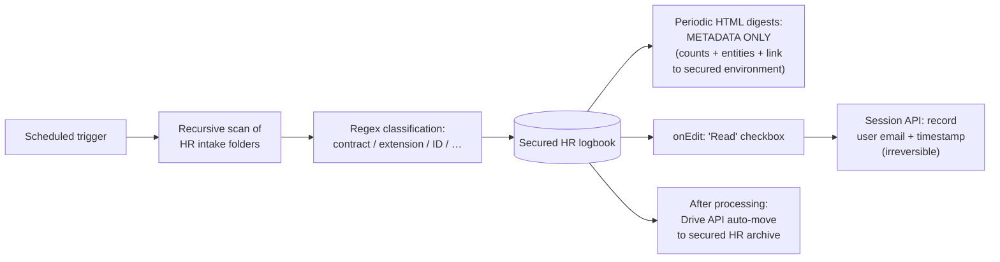

# GDPR-Compliant HR Document Pipeline

> **Context** Multi-entity HR department · weekly inflow of contracts, addendums, and ID documents
> **Stack** Google Apps Script · Google Drive · Gmail (metadata-only digests) · Session API
> **Category** HR operations, security & compliance

## The problem

Privacy-sensitive HR documents — signed contracts, addendums, copies of identity documents — arrived weekly across per-entity Drive folders. Three requirements collided: HR needed a central overview (documents were getting missed, payroll actions left undone), compliance demanded a hard audit trail (legally demonstrable *who* viewed and processed *which* document, *when*), and GDPR ruled out the existing habit of emailing files or file links around. The system had to provide visibility without ever moving sensitive content through email.

## Architecture

An autonomous processor recursively scans the locked-down HR intake folders on a schedule, classifies documents from filename conventions via regex, and logs them centrally. Notification digests contain **only metadata** — counts, entities, and a link into the secured environment — never file links. Marking a document as read fires an `onEdit` trigger that irreversibly records the acting user (via the Session API) with a timestamp; processed documents are auto-moved into the final, heavily restricted archive.

## Key decisions & trade-offs

- **Metadata-only notifications — privacy by design.** The single most important decision. Even a *link* to a sensitive file in an email extends the access surface to every inbox, forward, and mail archive. Digests saying "3 new documents for entity X" with a link to the secured logbook keep all access inside Drive's permission model, where it's controlled and auditable.
- **Audit trail via `onEdit` + Session API.** Recording `Session.getActiveUser()` plus timestamp at the moment of the "read" action produces the who/when evidence compliance needed, captured passively in the flow of normal work rather than via a separate logging duty nobody would perform. (Honest constraint: see limitations.)
- **Classification from naming conventions, not content.** Regex over filenames keeps the script from ever *parsing* document contents — a deliberate data-minimization choice as much as a simplicity one. The cost is dependence on naming discipline upstream.
- **Auto-archive after processing.** Inboxes stay empty and the archive accumulates under stricter permissions than the intake folders — separation of "being processed" and "stored" access levels.

## The hardest part

Making the audit trail trustworthy enough to lean on. An `onEdit`-based log is only evidence if it can't be quietly edited afterwards — which means protecting the audit columns from the very HR users whose actions they record, while those users still need write access to the adjacent workflow columns. Getting Sheets' protection model to enforce that split (and verifying the Session API reliably identified users across the domain) determined whether the whole compliance claim held. In practice, audit columns were not hard-locked — but they were visually distinguished via conditional formatting, making any edit immediately obvious to a reviewer. Accepted as sufficient for internal accountability at this organization's scale; a hard append-only column would be the right upgrade for higher-assurance environments.

## Results

- Sensitive content and file links no longer travel through email at all; notification reach and access reach are fully decoupled.
- Document classification and logging require zero manual entry; HR works from one secured, always-current logbook.
- A closed audit trail exists for every processed document: who marked it handled, and when — recorded irreversibly at action time.
- Processed documents are archived automatically under stricter permissions, keeping intake folders clean and access minimal.

## Limitations & what I'd do differently

- `Session.getActiveUser()` is reliable within a Workspace domain but the audit trail lives in a spreadsheet — strong for internal accountability, weaker as forensic evidence than an append-only external log. For higher assurance I'd mirror audit events to an immutable store.
- "Read" is recorded; *opening the file itself* is not (that's Drive's own activity log) — the two would ideally be correlated.
- Filename-convention classification shares the weakness of the [document management app](11-document-management-app.md): naming discipline is a human dependency.
- No retention automation is in place — GDPR also requires *deletion* schedules (e.g. ID copies after the legally required retention period); automating retention would complete the compliance story.
