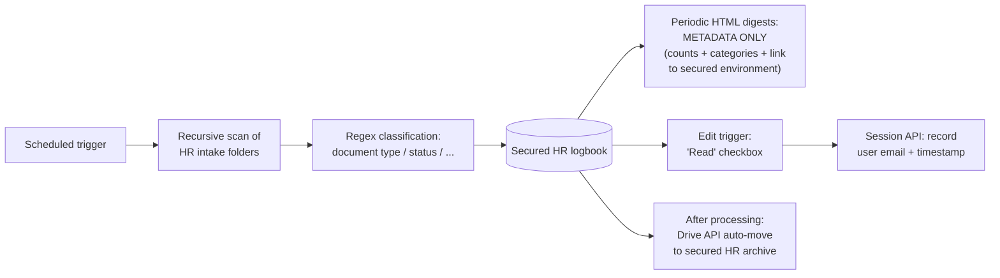

# Privacy-Conscious HR Document Workflow

> **Context** HR document intake · privacy-sensitive employee records
> **Stack** Google Apps Script · Google Drive · Gmail (metadata-only digests) · Session API
> **Category** HR operations, security & compliance

## The problem

Privacy-sensitive HR documents arrived across secured intake folders. HR needed a central overview, while access to sensitive content had to remain inside the existing permission model. Privacy requirements made it important to avoid sending sensitive content or broad file links through email, while still giving HR a reliable way to see which items needed action.

## Architecture

An autonomous processor recursively scans the locked-down HR intake folders on a schedule, classifies documents from filename conventions via regex, and logs them centrally. Notification digests contain **only metadata** — counts, categories, and a link into the secured environment — never file links. Marking a document as read fires an edit trigger that records the acting user with a timestamp; processed documents are auto-moved into the final, heavily restricted archive.

## Key decisions & trade-offs

- **Metadata-only notifications.** The single most important decision. Even a *link* to a sensitive file in an email extends the access surface to every inbox, forward, and mail archive. Digest messages with a link to the secured logbook keep access inside the storage platform's permission model.
- **Audit trail via edit trigger + user session.** Recording the active user plus timestamp at the moment of the "read" action creates reviewable who/when evidence, captured passively in the flow of normal work rather than via a separate logging duty nobody would perform. (Honest constraint: see limitations.)
- **Classification from naming conventions, not content.** Regex over filenames keeps the script from ever *parsing* document contents — a deliberate data-minimization choice as much as a simplicity one. The cost is dependence on naming discipline upstream.
- **Auto-archive after processing.** Inboxes stay empty and the archive accumulates under stricter permissions than the intake folders — separation of "being processed" and "stored" access levels.

## The hardest part

Making the audit trail useful enough for internal review. A spreadsheet-based log is only meaningful if audit columns are protected from routine edits while users still need write access to adjacent workflow columns. Getting the spreadsheet protection model to enforce that split, and confirming that the active-user signal was reliable in the environment, shaped the design. In practice, audit columns were not hard-locked, but they were visually distinguished via conditional formatting, making edits obvious to a reviewer. A hard append-only log would be the right upgrade for higher-assurance environments.

## Results

- Sensitive content and file links no longer travel through email at all; notification reach and access reach are fully decoupled.
- Document classification and logging require less manual handling; HR works from one secured, current logbook.
- A reviewable audit trail exists for processed documents: who marked them handled, and when.
- Processed documents are archived automatically under stricter permissions, keeping intake folders clean and access minimal.

## Limitations & what I'd do differently

- Active-user detection is reliable within a managed workspace domain, but the audit trail lives in a spreadsheet — strong for internal accountability, weaker as forensic evidence than an append-only external log.
- "Read" is recorded; *opening the file itself* is not (that's Drive's own activity log) — the two would ideally be correlated.
- Filename-convention classification shares the weakness of the [document management app](11-document-management-app.md): naming discipline is a human dependency.
- No retention automation is in place; automating deletion schedules would be the next privacy hardening step.
