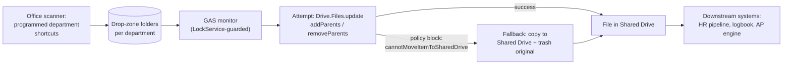

# Scanner-to-Cloud Document Routing (Hardware → Shared Drive)

> **Context** Office backoffice · weekly physical mail, receipts, and contracts to digitize
> **Stack** Office scanner (programmed shortcuts) · Google Drive "drop zones" · Google Apps Script · Drive API (advanced service)
> **Category** Hardware integration & cloud operations

## The problem

Digitizing physical post was a walk-and-drag workflow: scan, return to a PC, find the file in a generic "Scans" folder, manually move it to the right department folder. Making this zero-touch ran into two hard technical walls. First, the Drive API frequently **blocks programmatic moves into Shared Drives** (`cannotMoveItemToSharedDrive`) due to ownership rules between My Drive and Shared Drive items. Second, scanners deliver documents in bursts — a 30-page scan job drops many files near-simultaneously, and naive trigger-based processing produces race conditions: multiple script instances fighting over the same files.

## Architecture

Physical buttons on the scanner map to department-specific drop-zone folders. A fault-tolerant GAS monitor processes arrivals under a `LockService` mutex, attempts a legitimate fast move first, and on hitting Google's policy block switches seamlessly to plan B: copy into the Shared Drive, trash the original. Routed documents land exactly where the downstream automations (HR pipeline, document logbook, AP engine) expect them.

## Key decisions & trade-offs

- **The scanner's own buttons as the UI.** The routing decision is made by the person holding the paper, at the moment they know what it is — encoded in which button they press. No software UI to learn, no classification step later. The constraint: one button per destination, so the taxonomy must stay coarse.
- **Try-the-clean-way-first fallback architecture.** The copy+trash fallback always works but has real costs (new file ID, brief duplication). So the script *prefers* the legitimate move (`addParents/removeParents`) and only degrades when Google's policy engine says no. Resilience without paying the fallback's costs on every file.
- **`LockService` + paced API calls over per-file triggers.** Burst handling is serialized through a script lock, with deliberate sleeps (`SLEEP_MS`) between Drive calls to stay under rate limits. Throughput is capped, but a 40-page scan job arriving at once can no longer crash the pipeline or double-process files.
- **Trash, don't delete.** The fallback trashes originals rather than deleting them — a 30-day undo window for free, against a failure mode (copy succeeded but was somehow wrong) that's hard to rule out completely.

## The hardest part

The `cannotMoveItemToSharedDrive` block itself — because it's *intermittent*. The same operation succeeds or fails depending on file ownership, who uploaded it (scanner service account vs. user), and folder hierarchy, none of which the script controls. The breakthrough was reframing it: stop trying to find the conditions under which moves always succeed (they don't exist), and instead build the architecture to treat the failure as a normal, expected branch.

## Results

- Physical post handling reduced to: insert paper, press department button. Everything downstream is autonomous.
- The pipeline is robust against Google's Shared Drive ownership restrictions — the fallback path makes routing succeed regardless of which side of the policy a file lands on.
- Burst scans of dozens of pages process without crashes or double-handling, thanks to lock-serialized, rate-paced execution.
- Forms the intake layer for the rest of the document ecosystem: files arrive pre-sorted where the HR, logbook, and AP automations read.

## Limitations & what I'd do differently

- **The fallback changes the file ID** (a copy is a new file). Anything that captured a link to the original before routing breaks. Downstream systems here pick files up *after* routing so it's safe, but it's a real constraint to document for reuse.
- Routing fidelity depends on humans pressing the right button; there's no content verification. The automation itself cannot misdirect — it routes exactly where the button pointed — but a human dragging a file to the wrong folder manually bypasses it entirely. This was verified during setup; no misrouting incidents occurred in practice.
- Polling-based monitoring has the usual latency/quota trade-off; Drive change notifications would be the modern replacement.
- The lock serializes *everything* through one queue; per-department locks would raise throughput if volume grew.
