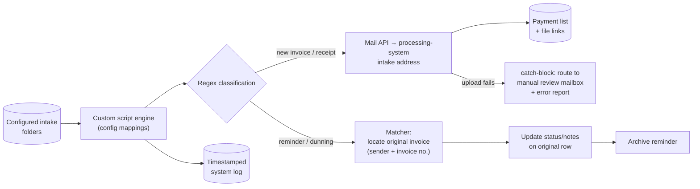

# Accounts Payable Automation & Intelligent Routing

> **Context** Financial administration for a grouped organization · recurring supplier-invoice processing
> **Stack** Custom scripts · cloud storage · email API · document-processing system · spreadsheet payment list
> **Category** Finance automation — accounts payable

## The problem

AP processing was a manual conveyor belt: download PDFs from various folders, retype them into the central payment list, forward them to the processing software, and repeat the same pattern across the administration. The hidden risk was **dunning letters**: payment reminders arriving as PDFs look exactly like invoices, and were regularly processed as *new* invoices — cluttering the administration and creating double-payment risk. The workflow needed visible failure handling so documents did not quietly disappear into the cloud.

## Architecture

A config-driven engine maps each intake folder to the relevant processing address. Regex over filenames splits the stream three ways: new invoices and receipts are mailed to the processing system *and* written to the payment list simultaneously; recognized reminders are **not** forwarded but matched to their original invoice, whose status gets updated before the reminder is archived. Failure paths land in a catch-block that reroutes the document, with an error report, to a manual review mailbox.

## Key decisions & trade-offs

- **Reminders as a first-class document type.** The expensive insight: the worst AP errors weren't bad data entry but *category* errors — reminders processed as invoices. Detecting them by filename pattern and routing them to an update-the-original flow, instead of the create flow, reduced the double-payment risk.
- **Filename-based classification vs. OCR/content parsing.** Filenames, largely standardized by suppliers and the scanning step upstream, were a reliable low-cost signal. OCR would handle arbitrary documents but adds cost, latency, and its own error modes. Right call at this volume; revisit if supplier naming degrades.
- **Fail loud, fail routed.** The catch-block doesn't log-and-continue — it *moves the document* to a human's mailbox with a diagnostic report. The failure mode changes from "invoice missing, discovered at dunning" to "invoice in your inbox with an error note, discovered today."
- **Dual write at intake.** The payment list isn't derived from the processing system later; both records are created in the same run, with file links, so finance has an internal view that doesn't depend on the external system's availability.

## The hardest part

Matching reminders to their originals. A dunning letter references its invoice loosely — sender naming varies, and invoice numbers appear in different filename positions and formats. The matching logic had to normalize both sides enough to match reliably, while a false positive match, updating the *wrong* invoice's status, is worse than no match. Tuning toward high precision, with unmatched reminders falling through to manual review, was the safe equilibrium.

## Results

- Double-payment risk from re-processed reminders is reduced because reminders *update* their original record instead of creating new ones.
- Documents are less likely to disappear silently because failure paths route to a reviewer with an error report.
- Incoming invoices reach both the accounting workflow and the payment list, with correct links and less manual entry.
- Action-level traceability is improved through timestamped system logging.

## Limitations & what I'd do differently

- Classification inherits the filename-convention dependency; a supplier changing naming silently shifts documents to the manual route (safe, but unautomated).
- Multi-invoice reminders would need explicit handling; the matching logic is designed for one reminder against one original invoice.
- Today, LLM-based document extraction has changed this trade-off — content-level parsing is now cheap enough that I'd classify on extracted fields (sender, invoice number, document type) rather than filenames, removing the convention dependency entirely. This is precisely the upgrade explored in my AI engineering roadmap.
