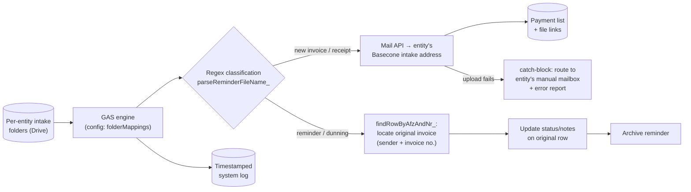

# Accounts Payable Automation & Intelligent Routing

> **Context** Financial administration for 13+ entities · a high monthly volume of supplier invoices
> **Stack** Google Apps Script · Google Drive · Gmail API · Basecone/WeFact (per-entity intake addresses) · Sheets ("Betaallijst" payment list)
> **Category** Finance automation — accounts payable

## The problem

AP processing was a manual conveyor belt: download PDFs from various folders, retype them into the central payment list, forward them to the processing software (Basecone) — per entity, repeatedly, every week. The hidden killer was **dunning letters**: payment reminders arriving as PDFs look exactly like invoices, and were regularly processed as *new* invoices — cluttering the administration and creating genuine double-payment risk. And one requirement was absolute: if anything in the chain fails, an invoice may never silently disappear into the cloud.

## Architecture

A config-driven engine maps each entity's Drive intake folder to its Basecone purchase email address. Regex over filenames splits the stream three ways: new invoices and receipts are mailed to Basecone *and* written to the payment list simultaneously; recognized reminders are **not** forwarded but matched to their original invoice (by sender + invoice number), whose status gets updated before the reminder is archived. Every failure path lands in a catch-block that reroutes the document, with an error report, to the entity's manual AP mailbox.

## Key decisions & trade-offs

- **Reminders as a first-class document type.** The expensive insight: the worst AP errors weren't bad data entry but *category* errors — reminders processed as invoices. Detecting them by filename pattern and routing them to an update-the-original flow (instead of the create flow) eliminated the double-payment class entirely.
- **Filename-based classification vs. OCR/content parsing.** Filenames (largely standardized by suppliers and the scanning step upstream) were a reliable, zero-cost, zero-latency signal. OCR would handle arbitrary documents but adds cost, latency, and its own error modes. Right call at this volume; revisit if supplier naming degrades.
- **Fail loud, fail routed.** The catch-block doesn't log-and-continue — it *moves the document* to a human's mailbox with a diagnostic report. The failure mode changes from "invoice missing, discovered at dunning" to "invoice in your inbox with an error note, discovered today."
- **Dual write (Basecone + payment list) at intake.** The payment list isn't derived from Basecone later; both records are created in the same run, with file links, so finance has an internal view that doesn't depend on the external system's availability.

## The hardest part

Matching reminders to their originals. A dunning letter references its invoice loosely — sender naming varies ("Acme B.V." vs "ACME"), invoice numbers appear in different filename positions and formats. `findRowByAfzAndNr_` had to normalize both sides enough to match reliably, while a false positive match (updating the *wrong* invoice's status) is worse than no match. Tuning toward high precision, with unmatched reminders falling through to the entity's manual AP mailbox (the same catch-block path as other failures), was the safe equilibrium.

## Results

- Double-payment risk from re-processed reminders eliminated; reminders now *update* their original record instead of creating new ones.
- Documents cannot silently disappear: every failure path ends at a named human with an error report, not in a void.
- Incoming invoices reach both the accounting software and the payment list, with correct links, within minutes — no manual entry.
- Full traceability: every action (success, failure, update) is timestamped in a system log, directly useful in accountant audits.

## Limitations & what I'd do differently

- Classification inherits the filename-convention dependency; a supplier changing naming silently shifts documents to the manual route (safe, but unautomated).
- Reminders in practice were always 1:1 per invoice, so multi-invoice reminders weren't a real-world occurrence in this setup — though the matching logic would have no safe way to handle them if they appeared.
- Today, LLM-based document extraction has changed this trade-off — content-level parsing is now cheap enough that I'd classify on extracted fields (sender, invoice number, document type) rather than filenames, removing the convention dependency entirely. This is precisely the upgrade explored in my AI engineering roadmap.
