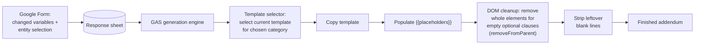

# Automated Contract Generation (HR Addendums)

> **Context** HR document workflow · addendums for changed employment terms
> **Stack** Google Forms · Google Sheets · Google Apps Script · Google Docs API (DOM manipulation)
> **Category** Legal tech & document generation

## The problem

Changed employment terms must be recorded consistently. In practice, HR copied an old employee's contract and overwrote it — with predictable results: leftover clauses from someone else's contract, wrong organization names or logos, empty gaps where optional terms didn't apply, and version drift as old templates kept circulating. Across a changing template set, the copy-paste method created avoidable document risk.

## Architecture

HR fills in a form — only the *changed* employment variables plus the relevant category — and the engine does the rest: select the current master template, copy it, populate placeholders, and structurally remove every optional clause that wasn't filled in.

## Key decisions & trade-offs

- **Form as the only input surface.** HR does not edit the document during generation; the human contribution is reduced to validated form fields. This is what reduces the copy-paste error class — not better templates, but removing the opportunity to edit one.
- **One master template per category, resolved at runtime.** The template selector picks the current template for the selected category. Template owners update a template once; future documents use the new version. No distribution problem, no stale copies in personal folders.
- **Structural clause removal vs. find-and-replace.** Standard merge tools replace `{{placeholder}}` with an empty string, leaving broken sentences and gaps. This engine walks the document structure: if an optional clause is absent, it finds the relevant parent element and removes it through the document API, then sweeps remaining blank lines. Unfilled options become invisible, not ugly.
- **Sheets as the audit log for free.** Every generated addendum's inputs persist as a form response row — who requested what change, when, for which entity.

## The hardest part

Safe structural deletion. Removing "the element containing this placeholder" is easy to get catastrophically wrong — if the placeholder sits in a table cell or a multi-clause paragraph, naive parent-removal deletes legal text that *should* stay. The engine had to identify the right ancestor level per placeholder type, and the whitespace-cleanup pass had to distinguish layout-intentional empty lines from removal debris. This forced template conventions and code to be designed together.

## Results

- The "someone else's data left in the contract" error class is reduced because every addendum starts from a clean, current template.
- Documents are presentation-clean regardless of which options apply: no gaps, no orphaned clauses, no double blank lines.
- Drafting time per addendum is reduced through form-driven generation.
- Template management is centralized: template owners edit once, with changes available to the relevant users.

## Limitations & what I'd do differently

- Templates and code share a contract (placeholder naming, element structure around optional clauses); a legal editor restructuring a template can break generation. A template-validation script that lints templates against the expected placeholders would catch this before production — no breakage occurred in practice, but the risk is real whenever a template is structurally edited.
- Generation feeds directly into an e-signature integration — the produced document goes into a signing flow without a manual handoff. The full loop from form input to executed, signed contract is automated end-to-end.
- Free-text form fields flow into a legal document unvalidated; stricter input validation (formats, ranges) on the form would harden the weakest remaining link.
