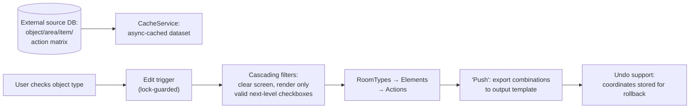

# Work Schedule Configurator (Interactive UI in Google Sheets)

> **Context** Operational planning · composing structured work schedules from valid object/area/item/action combinations
> **Stack** Google Apps Script · Google Sheets (as application UI) · CacheService · LockService · PropertiesService
> **Category** Internal tools & UI engineering

## The problem

The work schedule was a large matrix: which object type, which area types, which items in those areas, and which actions per item. Users assembled these by copying from large source documents — slow, and structurally error-prone in a specific way: nothing prevented invalid combinations from reaching output documents. A bespoke web application would solve it but was too costly and slow to build; the constraint was to deliver configurator-grade UX inside Google Sheets without the browser grinding to a halt.

## Architecture

The sheet behaves like a cascading configurator: each selection clears the levels below and dynamically renders only the checkboxes that are valid according to the source matrix. The heavy source dataset is cached for responsive interaction; a guarded edit trigger drives the interaction; a push action exports the configured matrix to the output template with undo support.

## Key decisions & trade-offs

- **Sheets as the app platform.** The honest comparison wasn't "Sheets vs. a nice web app" but "Sheets vs. no tool this quarter." Sheets avoided separate hosting and login management, and gave users a UI they already trusted. The trade-off: building UI behavior (cascading filters, dynamic controls) on a platform with no native support for it — which is exactly where the engineering interest lies.
- **Validity by construction, not validation after.** The UI renders only valid options, so invalid combinations are hard to produce rather than merely rejected later. This moves the source matrix into the role of single source of truth and reduces the review burden on output documents.
- **`CacheService` between the UI and the source database.** Reading thousands of matrix rows on every click would make the interaction unusable. Caching the dataset in script cache turns each cascade step into an in-memory filter — the difference between a "tool" and a "toy."
- **Undo via stored rollback coordinates.** The last export's target coordinates are stored, so a wrong push into an output template is reversible without a manual cleanup in a delivery document. Small feature, outsized trust effect: people use a push button much more freely when there's an undo.
- **Locking on edit events.** Rapid clicking fires overlapping trigger executions that can corrupt the render state mid-cascade; serializing them keeps the UI consistent.

## The hardest part

Performance under GAS's interaction model. Every edit-trigger call pays trigger-startup cost, and naive cell-by-cell rendering of checkbox ranges is brutally slow. Getting to a responsive interaction required batching reads/writes into range operations, minimizing spreadsheet service calls per trigger, and adding the cache layer for source data — performance work in an environment that gives you almost no instrumentation to do it with.

## Results

- Invalid work-schedule combinations are much harder to create because the interface reshapes itself from the source matrix.
- Composing a complex schedule is significantly faster than manual copy-paste.
- The interface responds quickly enough for practical daily use.
- Faulty exports are recoverable in one click without damaging output files.

## Limitations & what I'd do differently

- `CacheService` has size/TTL limits and the dataset had to be partitioned across multiple cache keys to fit — and a matrix update mid-cache-window serves stale options until expiry.
- The configurator handles composition only — which items and actions apply to an area type. Quantities, frequencies, and commercial calculations were out of scope and handled in a separate step.
- This is the project where Sheets-as-platform reached its ceiling: today, with my fullstack training, this is the first tool I'd rebuild as a small web app (the cascading-filter logic ports directly to React state) — while keeping the source matrix in Sheets where the team maintains it.
