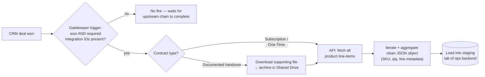

# Sales-to-Operations Data Pipeline (ETL)

> **Context** Handover from sales to operational planning on won deals
> **Stack** CRM · workflow automation platform · secure file storage · spreadsheet-based staging layer
> **Category** Data pipelines (ETL) & CRM automation

## The problem

A won deal triggers the real work: customer records, product line-items, planning attributes, and supporting documents must travel from the CRM into the operational planning systems. Done manually, this handover corrupted data exactly where it hurt — missing integration IDs, mistyped quantities, and related documents lost in inboxes. Three things made naive automation insufficient: deals could be marked "won" before upstream administrative IDs existed; deals carry *nested* multi-product data that a flat spreadsheet row can't hold; and some handovers required a supporting file to move along with the data.

## Architecture

A strict gatekeeper webhook fires only when a deal is won *and* carries both required integration IDs — i.e., only after the upstream [debtor](06-order-to-cash-automation.md) and [cost-center](07-multi-entity-cost-centers.md) flows have done their work. The flow then routes by handover type, extracts and transforms nested product data into a clean JSON object, archives any required supporting file to the operational Drive, and loads everything into the planning backend's staging tab.

## Key decisions & trade-offs

- **Gatekeeping at the source vs. validating at the destination.** Rejecting incomplete deals at the trigger reduces partial dossiers reaching operations, which means less cleanup and less risk of planning from incomplete data. The trade-off: a deal missing its IDs fires nothing and waits silently, which demands trust in the upstream chain. When a workflow step failed mid-run, a diagnostic note was written to the CRM deal — but deals that never triggered at all (still waiting on IDs) were invisible without actively checking the CRM.
- **JSON-in-a-cell as the transport format for line-items.** A deal's products are a variable-length nested structure; flattening to columns either truncates or explodes the schema. Aggregating line-items into one clean JSON string (SKU, quantities, line metadata) keeps the staging interface stable while the GAS backend parses it into whatever structure planning needs. Unorthodox, deliberate, and it worked — the schema never had to change for product-count reasons.
- **Files travel with the data where required.** When supporting documents are part of a handover, the workflow attempts to move the data and supporting file together in one coordinated process. Failure handling makes incomplete handovers visible rather than assuming every downstream action succeeded.
- **A staging tab as the contract between systems.** The workflow automation layer's responsibility ends at a well-defined drop-off point; the [ERP engine](18-financial-erp-refactor.md) takes over from there. Clean separation made both sides independently debuggable.

## The hardest part

The transform step. The CRM returns deal products as nested API resources that must be fetched separately, iterated, enriched with stable line metadata, and aggregated into one syntactically valid JSON string using the workflow platform's iterator/aggregator semantics — where escaping, separators, and empty-product edge cases all conspire against you. Producing JSON that parses consistently on the script side, across the deal shapes sales could produce, took most of the build time.

## Results

- Incomplete handovers are reduced because required identifiers are checked before transmission.
- Multi-line product structures arrive as clean, parseable data; manual re-entry is reduced in the handover.
- Supporting documents are archived alongside the related handover data where required.
- Handover lead time is shortened by moving routine transfer steps into the workflow.

## Limitations & what I'd do differently

- Silent gatekeeping is correct but opaque: a deal stuck missing one ID looks identical to a deal nobody won. No "blocked deals" digest was built — this remains a real operational gap where a digest would add meaningful visibility.
- JSON-in-a-cell trades queryability for schema stability — fine as a transport format, but it makes the staging tab itself unreadable to humans; a small rendered preview column would have helped support.
- Changes to a deal *after* handover (upsells, corrections) were confirmed out of scope and handled manually — the natural next iteration is an update event alongside the create event.
