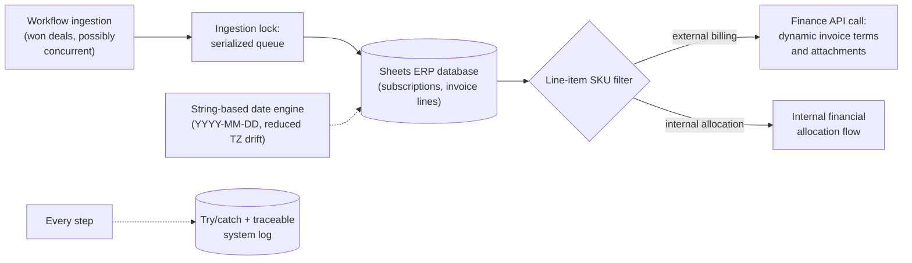

# Core Financial ERP Engine: Refactor & Concurrency Control

> **Context** Central financial backend — deal ingestion, invoice line generation, internal financial allocation — running on Google Sheets + GAS
> **Stack** Google Apps Script · LockService · WeFact API · Make.com (ingestion side)
> **Category** Software architecture, refactoring & ERP integration

## The problem

The organization's de-facto ERP was a complex Sheets/GAS ecosystem that predated any architectural discipline and was failing structurally under load. The critical defect: **race conditions on ingestion.** When the CRM pushed won deals near-simultaneously, script instances could both search for the next empty row at the same moment and write to it, creating overwrite risk and downstream invoicing issues. On top of that, recurring-invoice renewal dates drifted around timezone/DST boundaries, and the logic for internal financial allocation was too fragile to trust. This wasn't a greenfield build but the hardest kind of work: stabilizing a live financial system while it kept running.

## Architecture

The refactored engine serializes ingestion through a locking queue, splits external billing from internal allocation at the line-item level, constructs finance API payloads dynamically, and computes recurring dates through a custom string-based date engine that reduces timezone reinterpretation issues.

## Key decisions & trade-offs

- **Serialize ingestion rather than redesign storage.** The textbook fix for last-empty-row races is a database with atomic appends, but migrating the live financial backend off Sheets was a larger project the organization couldn't absorb at the time. A locking queue makes each API ingestion wait until the previous write cycle completes. Throughput is bounded by the lock, which was acceptable at this event rate, and overwrite risk was substantially reduced. Pragmatism with a documented upgrade path beats the perfect architecture you can't ship.
- **Refactor in place vs. rewrite.** Nine interdependent scripts in production, feeding real invoices, with no test environment that fully mirrors them — a big-bang rewrite risked replacing known bugs with unknown ones. The refactor went function by function, hardening each path (locking, dates, payloads, error handling) while behavior stayed observable against live output.
- **Dates as strings, deliberately.** The renewal-date drift came from date objects being constructed in one timezone context and reinterpreted in another (script project timezone vs. spreadsheet timezone vs. DST transitions) — off-by-one-day errors that became off-by-one-*month* after period arithmetic. The date engine treats dates as `YYYY-MM-DD` strings and does its own calendar arithmetic, locally interpreted, without date-object round trips.
- **SKU-driven routing for financial allocation.** Which lines follow the external billing path and which follow the internal allocation path is encoded in product SKUs — data the upstream flow already maintains — rather than in per-deal manual flags. The allocation flow became autonomous because its input signal already existed reliably.
- **Failure containment everywhere.** Every external call sits in try/catch with a timestamped trace log; an external system failing degrades one transaction with an audit trail, instead of halting the administrative process.

## The hardest part

Diagnosing the race condition. Intermittent, load-dependent data loss in a system with no debugger, minimal logging (initially), and triggers that execute invisibly server-side — the evidence was occasional missing customers, weeks after the fact. Reconstructing the failure (two instances, same empty row) from circumstantial evidence, then *reproducing it on purpose* with simulated concurrent webhooks to prove both the diagnosis and the fix, was the project's real engineering test. The lesson that stuck: in concurrent systems, "rarely" just means "eventually."

## Results

- Ingestion overwrite risk was reduced through serialized API handling.
- Internal financial allocation runs autonomously — recognized by SKU and processed without manual bookings.
- Recurring invoice date handling is more consistent across timezone and DST boundaries.
- A previously unstable codebase is more modular and traceable: transactions leave audit logs, and failures degrade more gracefully instead of halting invoicing.

## Limitations & what I'd do differently

- Sheets remains the database: the lock fixes write races, but there are no real transactions, schema, or referential integrity. This system is the strongest argument in the portfolio for the move to a proper backend (Postgres + API), and is exactly the class of system my current fullstack training targets.
- The global lock is a single throughput bottleneck — correct at this volume, but the first thing to shard if event rates grew significantly.
- Test coverage was entirely behavioral — watching live invoice output after each change, with no automated harness. Today I'd extract the pure logic (date engine, payload construction, SKU filters) into unit-testable modules first, *then* refactor behind those tests; the date engine in particular is pure input/output logic that would be trivial to cover and where a bug is maximally expensive.
