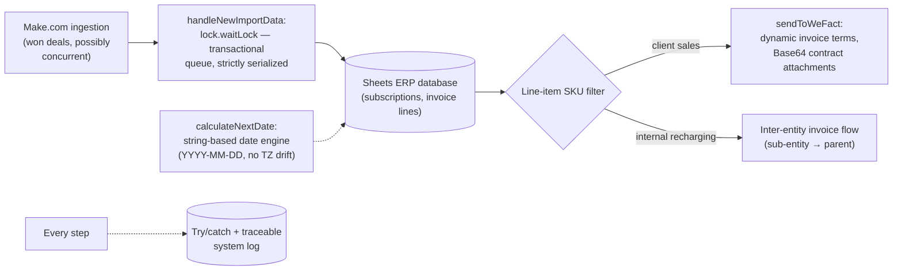

# Core Financial ERP Engine: Refactor & Concurrency Control

> **Context** Central financial backend of the group — deal ingestion, invoice line generation, internal recharging — running on Google Sheets + GAS (9 cooperating scripts, 1000+ LOC)
> **Stack** Google Apps Script · LockService · WeFact API · Make.com (ingestion side)
> **Category** Software architecture, refactoring & ERP integration

## The problem

The organization's de-facto ERP was a complex Sheets/GAS ecosystem that predated any architectural discipline — and it was failing structurally under load. The critical defect: **race conditions on ingestion.** When the CRM pushed two won deals near-simultaneously, two script instances both searched for "the last empty row" at the same moment and wrote to it — one deal overwrote the other, customer data was permanently lost, and invoicing stalled. On top of that: recurring-invoice renewal dates drifted by a month around timezone/DST boundaries, and the logic for internal recharging between entities was too fragile to trust. This wasn't a greenfield build but the hardest kind of work: stabilizing a live financial system while it kept running.

## Architecture

The refactored engine serializes all ingestion through a `LockService` transactional queue, splits sales from internal recharging by SKU at the line-item level, constructs WeFact API payloads dynamically (terms, encoding, Base64-embedded contract files), and computes recurring dates through a custom string-based date engine immune to timezone reinterpretation.

## Key decisions & trade-offs

- **Serialize ingestion rather than redesign storage.** The textbook fix for last-empty-row races is a database with atomic appends — but migrating the live financial backend off Sheets was a multi-month project the organization couldn't absorb. `lock.waitLock` creates a transactional queue: each API ingestion waits until the previous write cycle completes. Throughput is bounded by the lock, which is irrelevant at this event rate, and data loss went to zero. Pragmatism with a documented upgrade path beats the perfect architecture you can't ship.
- **Refactor in place vs. rewrite.** Nine interdependent scripts in production, feeding real invoices, with no test environment that fully mirrors them — a big-bang rewrite risked replacing known bugs with unknown ones. The refactor went function by function, hardening each path (locking, dates, payloads, error handling) while behavior stayed observable against live output.
- **Dates as strings, deliberately.** The renewal-date drift came from `Date` objects being constructed in one timezone context and reinterpreted in another (GAS project TZ vs. spreadsheet TZ vs. DST transitions) — off-by-one-day errors that became off-by-one-*month* after period arithmetic. `calculateNextDate` treats dates as `YYYY-MM-DD` strings and does its own calendar arithmetic, locally interpreted, no `Date` round-trips. Less idiomatic, fully deterministic.
- **SKU-driven routing for internal recharging.** Which lines are client revenue and which are inter-entity recharges is encoded in product SKUs — data the sales flow already maintains — rather than in per-deal manual flags. The recharging flow became autonomous because its input signal already existed reliably.
- **Failure containment everywhere.** Every external call sits in try/catch with a timestamped trace log; an external system failing degrades one transaction with an audit trail, instead of halting the administrative process.

## The hardest part

Diagnosing the race condition. Intermittent, load-dependent data loss in a system with no debugger, minimal logging (initially), and triggers that execute invisibly server-side — the evidence was occasional missing customers, weeks after the fact. Reconstructing the failure (two instances, same empty row) from circumstantial evidence, then *reproducing it on purpose* with simulated concurrent webhooks to prove both the diagnosis and the fix, was the project's real engineering test. The lesson that stuck: in concurrent systems, "rarely" just means "eventually."

## Results

- Ingestion data loss eliminated: concurrent API requests can no longer overwrite each other, regardless of arrival timing.
- Internal recharging between parent and sub-entities runs autonomously — recognized by SKU, invoiced without manual bookings.
- Recurring invoice dates are deterministic across timezone and DST boundaries; the month-drift class of billing errors is gone.
- A previously unstable, unmaintainable codebase is now modular and traceable: every transaction leaves an audit log, and failures degrade gracefully instead of halting invoicing.

## Limitations & what I'd do differently

- Sheets remains the database: the lock fixes write races, but there are no real transactions, schema, or referential integrity. This system is the strongest argument in the portfolio for the move to a proper backend (Postgres + API), and is exactly the class of system my current fullstack training targets.
- The global lock is a single throughput bottleneck — correct at this volume, but the first thing to shard if event rates grew 10×.
- Test coverage was entirely behavioral — watching live invoice output after each change, with no automated harness. Today I'd extract the pure logic (date engine, payload construction, SKU filters) into unit-testable modules first, *then* refactor behind those tests; the date engine in particular is pure input/output logic that would be trivial to cover and where a bug is maximally expensive.
