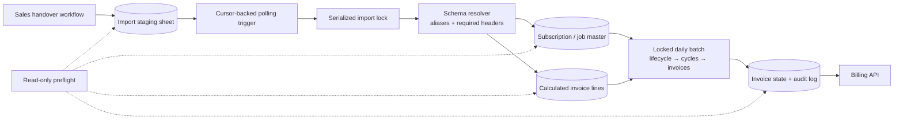

# Subscription Billing Engine: Migration, Concurrency & Failure Control

> **Context** Internal recurring-billing backend handling subscriptions, one-time work and invoice preparation
> **Stack** Google Apps Script · Google Sheets · LockService · billing API · workflow automation platform
> **Category** Software architecture, migration safety & financial automation

## The problem

A live Sheets and Apps Script backend had grown into the operational bridge between sales handover and billing. It imported won deals, created subscription or job records, expanded product line-items, advanced recurring dates, prepared invoice cycles and sent approved work to a billing API. A header and schema migration exposed several risks at once: concurrent imports could target the same row, API-written rows did not reliably trigger spreadsheet events, partial writes could leave master records without invoice lines, and an uncertain billing response could be retried into a duplicate invoice.

The requirement was not just to make the new workbook run. The migration had to preserve existing billing behavior while making failures visible and preventing unsafe automatic recovery.

## Architecture

The refactor introduced a shared schema layer that resolves old and new sheet names, maps header aliases to canonical fields and fails before writing when required columns are missing. Imports run through a persisted cursor and a script lock. Existing deals are checked for incomplete output and repaired instead of being blindly duplicated or skipped. The daily lifecycle, invoice-cycle generation and billing steps share one lock and propagate failures to an explicit state log.

## Key decisions & trade-offs

- **Poll API-written rows instead of trusting spreadsheet change events.** Writes made through an external API do not reliably fire the edit or change triggers used by human edits. A short-interval time trigger processes rows after the persisted cursor. This adds a small delay but gives every imported row a deterministic path.
- **Resolve schemas by names, not column positions.** Canonical field names, aliases and required-header checks allow the old and migrated layouts to coexist during rollout. The trade-off is a schema map that must be maintained deliberately whenever the workbook changes.
- **Repair partial imports idempotently.** If a deal already has a master record, the importer verifies its invoice lines and calculated totals and restores missing output where possible. This is safer than both "skip existing" and "write everything again" after an interrupted run.
- **Treat an ambiguous invoice response as a manual reconciliation event.** Once an invoice request may have reached the external system, the engine does not retry automatically. The cycle moves to a review-required state because a lost response can still represent a successful invoice. This sacrifices unattended recovery to avoid a financially worse duplicate.
- **Validate formulas before advancing the queue.** Formula-owned output columns are preserved, sheet capacity is extended before writes, and the importer waits for required calculated values before committing the cursor. That couples the script to the workbook's calculation contract, but prevents incomplete lines from entering billing.
- **Keep one global lock at the current volume.** Import and daily billing work are serialized because correctness matters more than throughput at this event rate. A database-backed queue would be the next step if volume made the lock a bottleneck.
- **Separate migration parity from safety changes.** A written parity audit lists retained flows, intentional behavior changes and duplicate-environment acceptance tests. This makes it clear which differences are defect fixes rather than accidental migration drift.

## The hardest part

The hardest part was defining safe behavior for every interruption point while preserving the business rules of a live financial process. A crash can happen after a master write, while formulas are calculating, after one of several invoices succeeds, or after the billing service accepts a request but before its response reaches the script. Those states cannot all be handled with a generic retry. The refactor therefore uses different recovery rules for local writes, calculated data and irreversible external side effects.

## Results

- Concurrent core processing is serialized, reducing same-row overwrite risk.
- API-written imports are processed through a durable cursor rather than an unreliable spreadsheet event.
- Partial imports can be detected and repaired without recreating complete deals.
- Missing headers, invalid dates, unresolved formulas and inconsistent linked records fail before billing.
- Ambiguous billing outcomes are held for reconciliation instead of being automatically retried.
- Old and migrated workbook layouts can be validated through the same canonical schema layer.
- Month-end date arithmetic and weekly, four-weekly, monthly, quarterly and annual frequencies follow one shared implementation.

## Limitations & what I'd do differently

- Sheets remains the datastore. Locking and validation reduce risk, but there are still no transactions, foreign keys or atomic multi-record commits. A relational database with an API and durable job queue is the long-term architecture.
- The preflight and parity audit provide broad migration coverage, but the pure calculation and state-transition functions still need automated unit tests. Duplicate-environment acceptance testing remains necessary before production rollout.
- Idempotent repair ends at the external billing boundary because that API flow has no application-controlled idempotency key. Ambiguous outcomes therefore require manual reconciliation.
- The global lock is intentionally conservative. Higher event volume would require smaller lock scopes or queue partitioning rather than a longer timeout.
