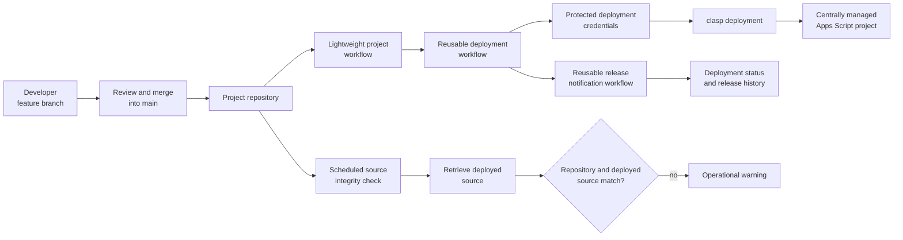

# Reusable GitHub Actions Deployment Framework (GitHub → Apps Script)

> **Context** Internal automation development across multiple repositories and developer identities  
> **Stack** GitHub Actions · Git · Google Apps Script · clasp  
> **Category** CI/CD, developer tooling & deployment governance

## The problem

Google Apps Script projects were developed across separate repositories and user accounts, while production scripts needed to remain centrally managed.

Without a standardized deployment process, several problems could arise:

- code stored in GitHub could diverge from the version running in Google Apps Script;
- production scripts could become dependent on personal developer accounts;
- deployments could vary between projects;
- improvements to deployment logic had to be copied manually between repositories;
- direct changes in the online Apps Script editor could bypass version control;
- deployment outcomes were not communicated consistently.

The goal was to preserve normal Git-based development while introducing one repeatable deployment architecture for centrally managed production scripts.

## Architecture

Each project repository contained its own source code, project-specific configuration and a lightweight caller workflow. The shared deployment logic lived in a separate workflow repository and was invoked through GitHub Actions reusable workflows. This allowed authentication, environment setup and deployment behaviour to be maintained centrally rather than duplicated across every project.

When code was merged into the primary branch, GitHub Actions authenticated against the centrally managed Apps Script environment and deployed the repository contents using `clasp`.

A separate scheduled workflow retrieved the deployed source and compared it with the version stored in GitHub. Its purpose was to identify direct changes made in the online Apps Script editor that had not passed through version control.

Deployment outcomes were routed through a reusable notification workflow, giving technical stakeholders visibility into successful and failed releases.

## Key decisions & trade-offs

- **GitHub as the intended source of truth.** Deployments originated from version-controlled repositories rather than relying on direct edits in the browser-based script editor.

- **Reusable workflows instead of duplicated YAML.** Shared deployment and notification logic was maintained centrally. Individual repositories only needed a lightweight caller workflow and their own project configuration.

- **Separate development identity from production ownership.** Developers could work through their own GitHub identities while production deployments remained centrally controlled.

- **Automated deployment through `clasp`.** Releases ran in a consistent GitHub-hosted environment rather than depending on local machines and locally stored authentication.

- **Integrity monitoring for direct online edits.** Scheduled comparisons made changes outside the intended Git workflow visible.

- **Operational notifications rather than silent automation.** Deployment outcomes were communicated automatically, making failures visible without requiring someone to inspect workflow runs manually.

- **Shared workflows introduce a central dependency.** Centralizing deployment behaviour reduces duplication, but changes to the shared workflow can affect multiple projects and therefore require careful maintenance.

## The hardest part

The hardest part was not running the deployment command. It was designing the boundary between independently maintained project repositories and centrally managed deployment infrastructure.

Each project needed its own code and deployment target, while authentication, environment setup, deployment behaviour and notifications needed to remain consistent.

The solution was to separate the architecture into three layers:

1. a lightweight workflow inside each project repository;
2. a shared deployment workflow containing the reusable `clasp` logic;
3. a shared notification workflow responsible for communicating release outcomes.

This reduced duplication and made deployment behaviour easier to maintain. Improvements to the shared workflow could benefit every project using it without manually changing the same logic in every repository.

A second challenge was keeping GitHub aligned with the deployed source. Google Apps Script still allows direct changes through its online editor, so deployment automation alone could not guarantee that both versions remained synchronized. Scheduled integrity checks were therefore introduced to surface differences.

## Results

- Deployment behaviour was standardized across multiple script repositories.
- Project code was version-controlled before being released to centrally managed Apps Script environments.
- Developers could work through individual GitHub identities without transferring production ownership to personal Google accounts.
- Shared deployment improvements could be maintained in one place instead of copied between repositories.
- Deployment attempts and failures became visible through GitHub Actions history and automated notifications.
- Direct changes outside the intended Git workflow could be surfaced through scheduled integrity checks.
- The reusable-workflow pattern was later applied to another deployment environment.

## Limitations & what I'd do differently

- The initial framework focused primarily on standardized deployment. A more mature version would add automated linting, tests and configuration validation before publishing.
- Shared workflows were consumed from a moving branch. I would introduce versioned workflow releases so project repositories could upgrade deliberately without immediately inheriting breaking changes.
- Integrity monitoring detected differences after they occurred. A future version could also perform a pre-deployment comparison and require review before overwriting unexpected remote changes.
